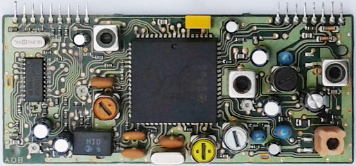

# TY45028AF -- PLL Synthesizer for FM/AM Radio

The TY45028AF is a PLL Synthesizer which could be found in old Ford
car radios, e.g. `2006R-RDS`.
According to the logo on the IC-package the chip was produced by
Motorola.
However by searching the world wide web it seems that there exists
no datasheet nor any information to get this chip up and running.
This description here is an attempt to change this.

The information which could be found here is a result of reverse
engineering a FM/AM tuner-module (see picture below) which
incorporates the `TY45028AF` and Infineon's `TUA4300P` respectively
`700053B`, and sniffing the traffic on I2C-bus combined with some
trial and error.  
**There is no guarantee for correctness nor completeness.**

------------------------------------------------------------------

# Circuit

The circuit below roughly shows how the `TY45028AF` is integrated
into Ford's `2006R-RDS` AM/FM tuner system.

Pin | description
--- | -----------
1   | OSC\_0
2   |
3   | SDA
4   | SCL
5   | Input 1
6   | Input 0
7   | IF counter input AM
8   | IF counter input FM
9   | Output 1
10  | Output 0
11  | Output 2
12  | Output 3
13  | Local oscillator FM
14  | Local oscillator AM
15  | VCC
16  |
17  | Phase detector output
18  | GND
19  | Buffered oscillator output
20  | OSC\_1

# Device access

The `TY45028AF` is controlled by commands transfered over I2C-bus
and it listens to the device address `0x62`.

Bit | 7 | 6 | 5 | 4 | 3 | 2 | 1 | 0
    | - | - | - | - | - | - | - | ---
    | 1 | 1 | 0 | 0 | 0 | 1 | 0 | R/W

# Register access

Depending on the length of the data sent to the `TY45028AF` access
to different registers is granted.
According to the I2C-protocol the PLL-chip correctly acknowledges
1-byte, 2-bytes and 3-bytes write-commands.
When reading the chip it seems that it returns always the same
byte.

## 1-Byte read -- status:

Bit | Function
--- | --------
7   |
6   | input 1 <- pin5
5   | input 0 <- pin6
4   |
3   |
2   |
1   |
0   |

> Input is connected to tuner's FM stereo indicator

## 1-Byte write -- port settings:

Bit | Function
--- | --------
7   |
6   |
5   | mode1
4   | mode0
3   | output 3 -> pin12
2   | output 2 -> pin11
1   | output 1 -> pin9
0   | output 0 -> pin10

> Output 0 is connected to tuner's AM/FM switch
> where 0 is AM and 1 is FM

mode1 | mode0 | Description
----- | ----- | -----------
0     | 0     | test: f\_osc / N
0     | 1     |
1     | 0     |
1     | 1     |

## 2-Bytes write -- divider:

If 2 bytes are written to the chip the main divider register
is accessed.

### first byte -- MSB

Bit | Function
--- | --------
7   |
6   | n\_14
5   | n\_13
4   | n\_12
3   | n\_11
2   | n\_10
1   | n\_9
0   | n\_8

### second byte -- LSB

Bit | Function
--- | --------
7   | n\_7
6   | n\_6
5   | n\_5
4   | n\_4
3   | n\_3
2   | n\_2
1   | n\_1
0   | n\_0

## 3-Bytes write -- setup:

Writing 3 bytes to the chip accesses a setup register and the
reference divider

### first byte -- identifier:

Value | Description
----- | ----------
0x04  | set reference divider for FM
0x05  | set reference divider for FM
0x06  | set reference divider for AM

> When value is `0x06` and mode is set to `test` the reference
> divider's output is forwarded to pin10

### second byte -- MSB:

Bit | Function
--- | --------
7   |
6   |
5   | n\_13
4   | n\_12
3   | n\_11
2   | n\_10
1   | n\_9
0   | n\_8

### third byte -- LSB

Bit | Function
--- | --------
7   | n\_7
6   | n\_6
5   | n\_5
4   | n\_4
3   | n\_3
2   | n\_2
1   | n\_1
0   | n\_0

------------------------------------------------------------------

# Initialization examples

The initialization examples are related to a tuner-module which is
part of the `2006R-RDS` car radio.

## FM:

Byte 1 | Byte 2 | Byte 3 | Explanation
------ | ------ | ------ | -----------
0x04   | 0x00   | 0xcf   | 10.35MHz / 207 = 50kHz reference
0x11   |        |        | mode = 1, FM
0x08   | 0x94   |        | 2196 --> 10.7MHz + 99.1MHz
0x07   | 0xf6   |        | 2038 --> 10.7MHz + 91.2MHz

## AM:

Byte 1 | Byte 2 | Byte 3 | Explanation
------ | ------ | ------ | -----------
0x06   | 0x28   | 0x6e   | 10.35MHz / 10350 = 1kHz reference
0x10   |        |        | mode = 1, AM
0x2c   | 0xb8   |        | 11448 --> 10.35MHz + 450kHz + 648kHz
0x2c   | 0x5e   |        | 11358 --> 10.35MHz + 450kHz + 558kHz

